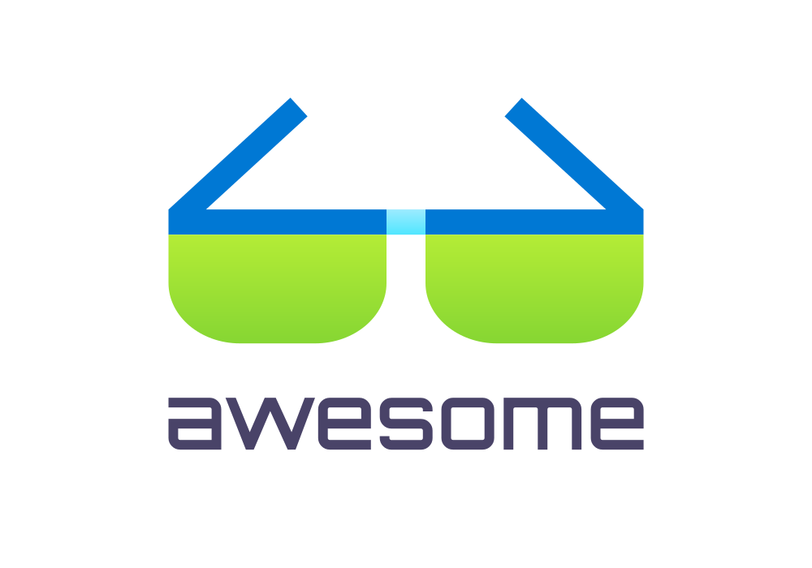

	
 
 	
	

		Just type <a href="https://awesomeais.net"><code>awesomeais.net</code></a> to go here.
	

	 
	

		<a href="https://azure.microsoft.com/solutions/integration-services">Azure Integration Services</a> (hereafter called AIS) is Microsoft's suite of cloud-native services for connecting applications, data, and processes across cloud and on-premises environments, in other words, <strong>iPaaS</strong> (Integration Platform as a Service).
	

	 

## Contents

- [Official Resources](#official-resources)
- [Tools and Utilities](#tools-and-utilities)
- [Articles and Blog Posts](#articles-and-blog-posts)
- [Videos and Courses](#videos-and-courses)
- [Books](#books)
- [Communities](#communities)

## Official Resources

<!-- Official Microsoft documentation, landing pages, and announcements. -->

- [Azure Integration Services application landing zone accelerator in an Azure landing zone](https://learn.microsoft.com/en-us/azure/cloud-adoption-framework/scenarios/app-platform/integration-services/landing-zone-accelerator) - Provides strategic guidance for deploying AIS within an Azure landing zone.

## Articles and Blog Posts

<!-- High-quality blog posts, tutorials, and write-ups on Azure Integration Services topics. -->
- [Integration Playbook](https://www.integration-playbook.io/docs) - Curated by Michael Stephenson to help people understand topics around architecture and implementation of Integration projects using Microsoft Technologies.

## Tools and Utilities

<!-- SDKs, CLI tools, VS Code extensions, open-source projects, and other utilities that enhance working with Azure Integration Services. -->

- [API-based messaging](https://github.com/your-azure-coach/api-based-messaging) - An API-based messaging solution, that combines the power of Azure API Management and Azure Event Grid Namespaces.
- [Azure Integration Services Quickstart](https://github.com/ronaldbosma/azure-integration-services-quickstart) - A template for quickly deploying AIS, ideal for demos, testing or getting started with AIS.

## Videos and Courses

<!-- Talks, recordings, conference sessions, and online courses. -->
- [Generative AI by The Agent Frontier](https://www.youtube.com/playlist?list=PLmqRsTshEmekitQ-ks1d39CjXqaYkbsMr) - A YouTube playlist around Generative AI mainly focused on Logic Apps by Kent Weare.

## Books

<!-- Books covering Azure integration patterns, architecture, and services. -->

- [Enterprise Integration Patterns](https://www.enterpriseintegrationpatterns.com/) - An invaluable catalog of sixty-five patterns, with real-world solutions that demonstrate the formidable of messaging and help you to design effective messaging solutions for your enterprise.

## Communities

<!-- Newsletters, forums, user groups, and other community resources. -->
- [Logic Apps Aviators](https://www.linkedin.com/groups/15771047/) - An initiative centered on Azure Logic Apps and the broader AIS ecosystem to bring together integration enthusiasts to share knowledge, create learning opportunities, and build connections.

